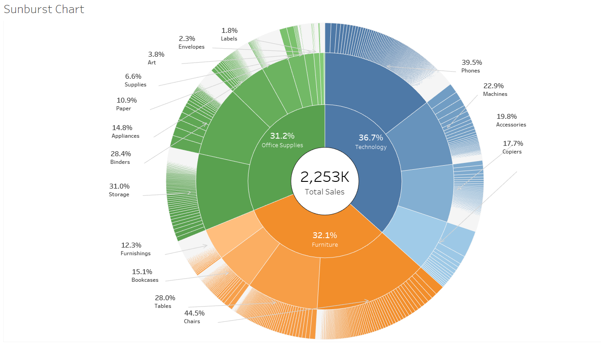
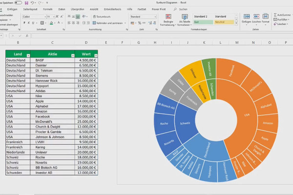
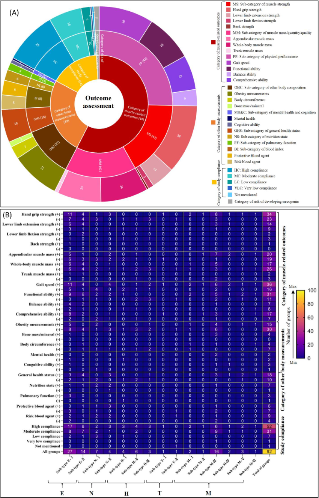
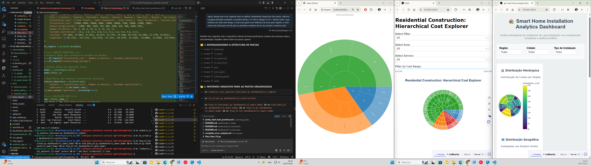

# 📊 **Python Data Driven Visualization Journey**


> **Uma jornada completa do desenvolvimento de dashboards Plotly/Dash: desde visualizações simples até análises complexas com Machine Learning**

---

## 🎯 **Visão Geral**

Este repositório documenta a evolução completa de um projeto de dashboards interativos, começando com um aplicativo Dash problemático e culminando em três versões funcionais progressivamente mais sofisticadas:

- **V1**: Dashboard simples com gráfico Sunburst
- **V2**: Dashboard de construção com filtros avançados
- **V3**: Dashboard complexo com ML, mapas e múltiplas visualizações

### **🎨 Inspiração Visual**
O projeto foi guiado por referências visuais profissionais que definiram nossos padrões de qualidade:

<div align="center">

| Sunburst Hierárquico | Análise Científica | Dashboard Comercial |
|:---:|:---:|:---:|
|  |  |  |
| *Estrutura hierárquica complexa* | *Correlação e heatmap* | *Vendas por categoria* |

</div>

---

## 📊 **Dashboards Funcionais**

### 🌟 **V1 - Sunburst Simples** 
**Porta: 8052** | **Foco: Fundamentos**
- ✅ Gráfico Sunburst hierárquico
- ✅ Dados extraídos de HTML funcional
- ✅ Interface limpa e responsiva
- ✅ Métricas financeiras básicas

### 🏗️ **V2 - Construção Avançada**
**Porta: 8050** | **Foco: Filtros & Interatividade**
- ✅ Filtros em cascata (Pillar → Area → Service)
- ✅ Tooltips detalhados com variâncias
- ✅ Análise de custos de construção
- ✅ Interface profissional

### 🏡 **V3 - Smart Home Complexo**
**Porta: 8053** | **Foco: ML & Análise Avançada**
- ✅ **4 Visualizações**: Sunburst + Mapa + Scatter + ML
- ✅ **Machine Learning**: Análise preditiva de economia de energia
- ✅ **Mapas Geográficos**: Coordenadas reais dos EUA
- ✅ **Design Moderno**: Cards responsivos com styling avançado

---

## 🚀 **Quick Start**

### **Instalação**
```bash
git clone https://github.com/Genovese-Felipe/Python-Data-Driven-Visualization-Journey.git
cd Python-Data-Driven-Visualization-Journey
pip install -r requirements.txt
```

### **Executar Dashboards**
```bash
# V1 - Sunburst Simples
python dashboards/v1_simple/sunburst_cost_explorer_funcional.py
# Acesse: http://localhost:8052

# V2 - Construção Avançada  
python dashboards/v2_construction/V2_script.py
# Acesse: http://localhost:8050

# V3 - Smart Home Complexo
python dashboards/v3_smart_home/Plan_V3_funcional.py
# Acesse: http://localhost:8053
```

---

## 📁 **Estrutura do Projeto**

```
Python-Data-Driven-Visualization-Journey/
├── 📊 dashboards/
│   ├── 🌟 v1_simple/           # Dashboard básico com Sunburst
│   ├── 🏗️ v2_construction/     # Dashboard de construção com filtros
│   └── 🏡 v3_smart_home/       # Dashboard complexo com ML
├── 📚 docs/                    # Documentação e guias
├── 🔴 error_reports/           # Relatórios de erros e lições aprendidas
├── 🤖 ai_learning_guides/      # Instruções para futuros modelos de IA
├── 🎨 assets/                  # Arquivos de referência e recursos
│   ├── 🖼️ reference_images/    # Imagens que inspiraram o projeto
│   ├── 📸 screenshots/         # Capturas de tela da evolução
│   └── 📄 HTML files           # Arquivos funcionais para extração de dados
├── 📋 requirements.txt         # Dependências do projeto
└── 📖 README.md               # Este arquivo
```

---

## 🛠️ **Tecnologias Utilizadas**

| Categoria | Tecnologia | Versão | Uso |
|-----------|------------|---------|-----|
| **Backend** | Python | 3.12+ | Linguagem principal |
| **Web Framework** | Dash | 2.x | Aplicações web interativas |
| **Visualização** | Plotly | 5.x | Gráficos e visualizações |
| **Machine Learning** | Scikit-Learn | 1.x | Análise preditiva |
| **Data Processing** | Pandas | 2.x | Manipulação de dados |
| **Scientific Computing** | NumPy | 1.x | Computação numérica |

---

## 📈 **Evolução do Projeto**

### **Ponto de Partida: Referências Visuais** 🎨
Baseamo-nos em referências visuais profissionais para definir o padrão de qualidade:


*Exemplo de Sunburst hierárquico complexo usado como inspiração*

### **Fase 1: Problema Inicial** 🔥
- App Dash com múltiplos erros de callback
- Estrutura hierárquica mal construída
- Interface não responsiva
- **Status**: ❌ Não funcional

### **Fase 2: Análise & Correção** 🔍
- Análise de arquivos HTML funcionais
- Extração de dados estruturados
- Identificação de padrões funcionais
- **Status**: 🔄 Em desenvolvimento

### **Fase 3: V1 - Fundação Sólida** ✅
- Dashboard simples e funcional
- Dados reais extraídos de HTML
- Gráfico Sunburst perfeitamente renderizado
- **Status**: ✅ Funcional

### **Fase 4: V2 - Interatividade Avançada** 🏗️
- Sistema de filtros em cascata
- Tooltips informativos
- Análise de variâncias de custos
- **Status**: ✅ Funcional

### **Fase 5: V3 - Complexidade Total** 🏡
- 4 tipos de visualização integrados
- Machine Learning para análise preditiva
- Mapas geográficos interativos
- **Status**: ✅ Funcional

### **Resultado Final: Três Dashboards Funcionais** 🎉

*Screenshot dos três dashboards rodando simultaneamente: V1 (Sunburst), V2 (Construction), V3 (Smart Home)*

---

## 🎓 **Lições Aprendidas**

### **✅ O que Funcionou**
- Análise de código funcional existente
- Extração de dados estruturados de HTML
- Desenvolvimento incremental (V1 → V2 → V3)
- Foco na funcionalidade antes da complexidade
- **Uso de referências visuais profissionais**
- **Documentação visual completa da jornada**

### **❌ Erros Comuns Evitados**
- Callbacks complexos demais
- Estruturas hierárquicas mal planejadas
- Tentativa de corrigir código quebrado vs. recriar
- Falta de dados estruturados adequados
- **Desenvolvimento sem referências visuais claras**

### **📸 Documentação Visual**
Todo o processo foi documentado visualmente:
- 🎨 [Jornada Visual Completa](docs/visual_journey.md)
- 🖼️ [Imagens de Referência](assets/reference_images/)
- 📸 [Screenshots da Evolução](assets/screenshots/)

---

## 🤝 **Contribuições**

Este projeto serve como:
- **Template** para dashboards Plotly/Dash
- **Guia de boas práticas** para visualização de dados
- **Exemplo de evolução** de projeto de dados
- **Referência de debugging** para aplicações Dash

---

## � **Licença**

Este projeto está licenciado sob a [MIT License](LICENSE).

---

## 👨‍💻 **Autor**

**Felipe Genovese**
- GitHub: [@Genovese-Felipe](https://github.com/Genovese-Felipe)
- Projeto: [Python Data Driven Visualization Journey](https://github.com/Genovese-Felipe/Python-Data-Driven-Visualization-Journey)

---

## 📞 **Suporte**

Para dúvidas, problemas ou sugestões:
1. Consulte a [documentação](docs/)
2. Verifique os [relatórios de erro](error_reports/)
3. Abra uma [Issue](https://github.com/Genovese-Felipe/Python-Data-Driven-Visualization-Journey/issues)

---

<div align="center">

**🎉 Projeto Concluído com Sucesso! 🎉**

*De um app quebrado para três dashboards funcionais com ML*

</div>