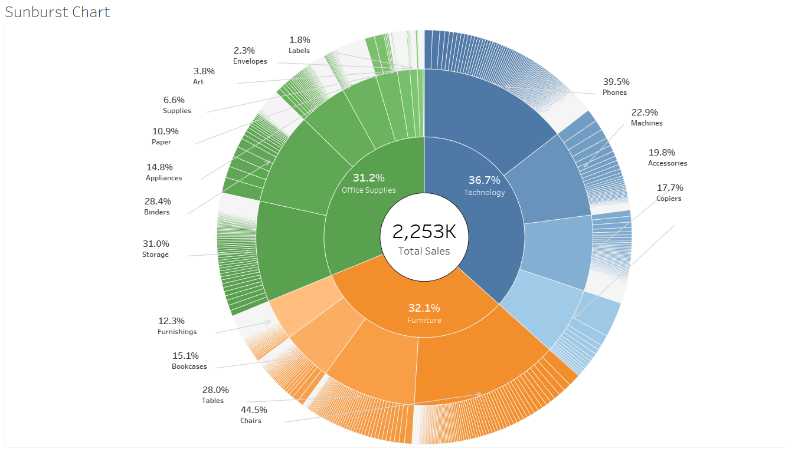
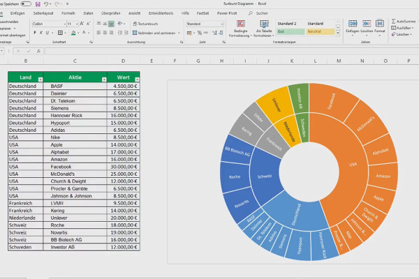
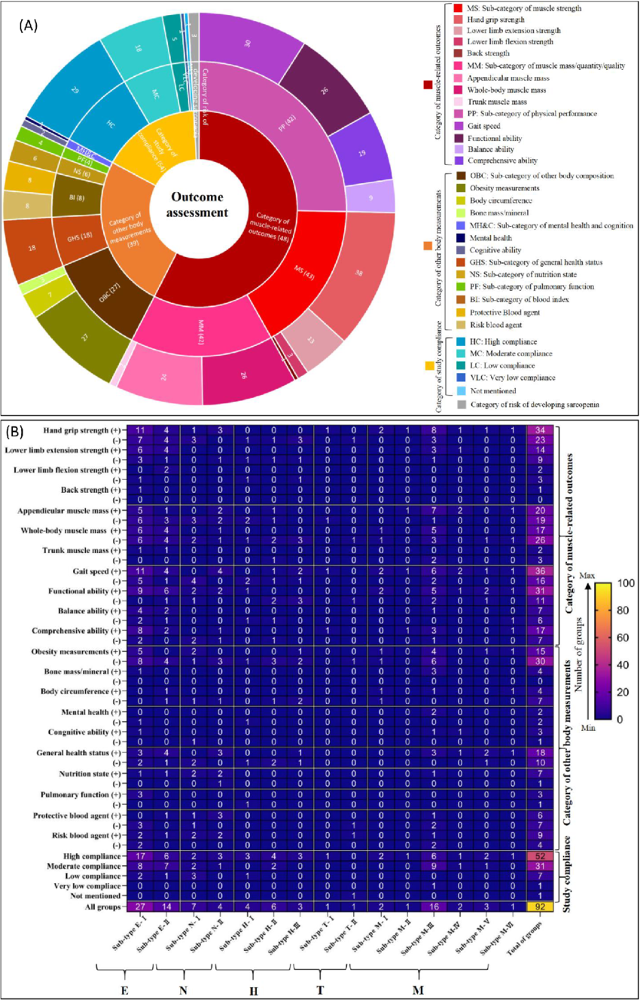
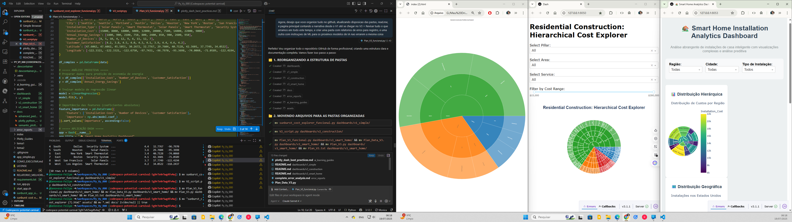

# 📊 **Python Data Driven Visualization Journey**
# 🇧🇷 **Português** | 🇺🇸 **English**

<!--
Palavras-chave/Keywords: dashboards, data visualization, Plotly, Dash, Machine Learning, Python, análise de dados, visualização interativa, construção, smart home, energia, ML, open source, tutorial, guia, project evolution, dashboard templates, aprendizado de máquina, visualização de custos, referência, best practices, exemplos, portfolio, portfolio de dados, data science, análise preditiva, interactive dashboard, business intelligence, BI, engenharia de dados, data engineering
-->

<details>
<summary><strong>🇧🇷 Português (clique para expandir)</strong></summary>

**Nomes de Pastas e Descrições (PT/EN):**

- `dashboards/` — Dashboards interativos (Interactive dashboards)
- `docs/` — Documentação e guias (Documentation and guides)
- `error_reports/` — Relatórios de erros e lições aprendidas (Error reports and lessons learned)
- `ai_learning_guides/` — Instruções para IA e aprendizado de máquina (AI and ML learning guides)
- `assets/` — Imagens, screenshots e arquivos de referência (Images, screenshots, reference files)
- `requirements.txt` — Dependências do projeto (Project dependencies)
- `README.md` — Documentação principal (Main documentation)


> **Uma jornada completa do desenvolvimento de dashboards Plotly/Dash: desde visualizações simples até análises complexas com Machine Learning**

---


## 🎯 **Visão Geral**


Este repositório documenta a evolução completa de um projeto de dashboards interativos, começando com um aplicativo Dash problemático e culminando em três versões funcionais progressivamente mais sofisticadas:

- **V1**: Dashboard simples com gráfico Sunburst
- **V2**: Dashboard de construção com filtros avançados
- **V3**: Dashboard complexo com ML, mapas e múltiplas visualizações


### **🎨 Inspiração Visual**
O projeto foi guiado por referências visuais profissionais que definiram nossos padrões de qualidade:

<div align="center">

| Sunburst Hierárquico | Análise Científica | Dashboard Comercial |
|:---:|:---:|:---:|
|  |  |  |
| *Estrutura hierárquica complexa* | *Correlação e heatmap* | *Vendas por categoria* |

</div>

---


## 📊 **Dashboards Funcionais**

### 🌟 **V1 - Sunburst Simples**
**Porta: 8052** | **Foco: Fundamentos**
- ✅ Gráfico Sunburst hierárquico
- ✅ Dados extraídos de HTML funcional
- ✅ Interface limpa e responsiva
- ✅ Métricas financeiras básicas

### 🏗️ **V2 - Construção Avançada**
**Porta: 8050** | **Foco: Filtros & Interatividade**
- ✅ Filtros em cascata (Pillar → Area → Service)
- ✅ Tooltips detalhados com variâncias
- ✅ Análise de custos de construção
- ✅ Interface profissional

### 🏡 **V3 - Smart Home Complexo**
**Porta: 8053** | **Foco: ML & Análise Avançada**
- ✅ **4 Visualizações**: Sunburst + Mapa + Scatter + ML
- ✅ **Machine Learning**: Análise preditiva de economia de energia
- ✅ **Mapas Geográficos**: Coordenadas reais dos EUA
- ✅ **Design Moderno**: Cards responsivos com styling avançado

---


## 🚀 **Quick Start**

### **Instalação**
```bash
git clone https://github.com/Genovese-Felipe/Python-Data-Driven-Visualization-Journey.git
cd Python-Data-Driven-Visualization-Journey
pip install -r requirements.txt
```

### **Executar Dashboards**
```bash
# V1 - Sunburst Simples
python dashboards/v1_simple/sunburst_cost_explorer_funcional.py
# Acesse: http://localhost:8052

# V2 - Construção Avançada  
python dashboards/v2_construction/V2_script.py
# Acesse: http://localhost:8050

# V3 - Smart Home Complexo
python dashboards/v3_smart_home/Plan_V3_funcional.py
# Acesse: http://localhost:8053
```

---


## 📁 **Estrutura do Projeto**

```
Python-Data-Driven-Visualization-Journey/
├── 📊 dashboards/
│   ├── 🌟 v1_simple/           # Dashboard básico com Sunburst
│   ├── 🏗️ v2_construction/     # Dashboard de construção com filtros
│   │   ├── data.csv            # Dados para o dashboard V2
│   │   └── V2_script.py
│   └── 🏡 v3_smart_home/       # Dashboard complexo com ML
│       ├── data.csv            # Dados para o dashboard V3
│       ├── model.py            # Modelo preditivo para o dashboard V3
│       └── Plan_V3_funcional.py
├── 📂 data/                    # Arquivos de dados para aplicações no diretório raiz
│   ├── app_simples_data.csv
│   └── run_app_data.csv
├── 📚 docs/                    # Documentação e guias
├── 🔴 error_reports/           # Relatórios de erros e lições aprendidas
├── 🤖 ai_learning_guides/      # Instruções para futuros modelos de IA
├── 🎨 assets/                  # Arquivos de referência e recursos
│   ├── 🖼️ reference_images/    # Imagens que inspiraram o projeto
│   ├── 📸 screenshots/         # Capturas de tela da evolução
│   └── 📄 HTML files           # Arquivos funcionais para extração de dados
├── 📋 requirements.txt         # Dependências do projeto
└── 📖 README.md               # Este arquivo
```

---


## 🛠️ **Tecnologias Utilizadas**

| Categoria | Tecnologia | Versão | Uso |
|-----------|------------|---------|-----|
| **Backend** | Python | 3.12+ | Linguagem principal |
| **Web Framework** | Dash | 2.x | Aplicações web interativas |
| **Visualização** | Plotly | 5.x | Gráficos e visualizações |
| **Machine Learning** | Scikit-Learn | 1.x | Análise preditiva |
| **Data Processing** | Pandas | 2.x | Manipulação de dados |
| **Scientific Computing** | NumPy | 1.x | Computação numérica |

---


## 📈 **Evolução do Projeto**

### **Ponto de Partida: Referências Visuais** 🎨
Baseamo-nos em referências visuais profissionais para definir o padrão de qualidade:


*Exemplo de Sunburst hierárquico complexo usado como inspiração*

### **Fase 1: Problema Inicial** 🔥
- App Dash com múltiplos erros de callback
- Estrutura hierárquica mal construída
- Interface não responsiva
- **Status**: ❌ Não funcional

### **Fase 2: Análise & Correção** 🔍
- Análise de arquivos HTML funcionais
- Extração de dados estruturados
- Identificação de padrões funcionais
- **Status**: 🔄 Em desenvolvimento

### **Fase 3: V1 - Fundação Sólida** ✅
- Dashboard simples e funcional
- Dados reais extraídos de HTML
- Gráfico Sunburst perfeitamente renderizado
- **Status**: ✅ Funcional

### **Fase 4: V2 - Interatividade Avançada** 🏗️
- Sistema de filtros em cascata
- Tooltips informativos
- Análise de variâncias de custos
- **Status**: ✅ Funcional

### **Fase 5: V3 - Complexidade Total** 🏡
- 4 tipos de visualização integrados
- Machine Learning para análise preditiva
- Mapas geográficos interativos
- **Status**: ✅ Funcional

### **Resultado Final: Três Dashboards Funcionais** 🎉

*Screenshot dos três dashboards rodando simultaneamente: V1 (Sunburst), V2 (Construction), V3 (Smart Home)*

---


## 🎓 **Lições Aprendidas**

### **✅ O que Funcionou**
- Análise de código funcional existente
- Extração de dados estruturados de HTML
- Desenvolvimento incremental (V1 → V2 → V3)
- Foco na funcionalidade antes da complexidade
- **Uso de referências visuais profissionais**
- **Documentação visual completa da jornada**

### **❌ Erros Comuns Evitados**
- Callbacks complexos demais
- Estruturas hierárquicas mal planejadas
- Tentativa de corrigir código quebrado vs. recriar
- Falta de dados estruturados adequados
- **Desenvolvimento sem referências visuais claras**

### **📸 Documentação Visual**
Todo o processo foi documentado visualmente:
- 🎨 [Jornada Visual Completa](docs/visual_journey.md)
- 🖼️ [Imagens de Referência](assets/reference_images/)
- 📸 [Screenshots da Evolução](assets/screenshots/)

---


## 🤝 **Contribuições**

Este projeto serve como:
- **Template** para dashboards Plotly/Dash
- **Guia de boas práticas** para visualização de dados
- **Exemplo de evolução** de projeto de dados
- **Referência de debugging** para aplicações Dash

---

## 📝 **Licença**

Este projeto está licenciado sob a [MIT License](LICENSE).

---


## 👨‍💻 **Autor**

**Felipe Genovese**
- GitHub: [@Genovese-Felipe](https://github.com/Genovese-Felipe)
- Projeto: [Python Data Driven Visualization Journey](https://github.com/Genovese-Felipe/Python-Data-Driven-Visualization-Journey)

---


## 📞 **Suporte**

Para dúvidas, problemas ou sugestões:
1. Consulte a [documentação](docs/)
2. Verifique os [relatórios de erro](error_reports/)
3. Abra uma [Issue](https://github.com/Genovese-Felipe/Python-Data-Driven-Visualization-Journey/issues)

---

<div align="center">

**🎉 Projeto Concluído com Sucesso! 🎉**

*De um app quebrado para três dashboards funcionais com ML*

</div>

</details>

---

<details open>
<summary><strong>🇺🇸 English (click to expand)</strong></summary>

**Folder Names and Descriptions (EN/PT):**

- `dashboards/` — Interactive dashboards (Dashboards interativos)
- `docs/` — Documentation and guides (Documentação e guias)
- `error_reports/` — Error reports and lessons learned (Relatórios de erros e lições aprendidas)
- `ai_learning_guides/` — AI and ML learning guides (Instruções para IA e aprendizado de máquina)
- `assets/` — Images, screenshots, reference files (Imagens, screenshots, arquivos de referência)
- `requirements.txt` — Project dependencies (Dependências do projeto)
- `README.md` — Main documentation (Documentação principal)

# 📊 **Python Data Driven Visualization Journey**

> **A complete journey in Plotly/Dash dashboard development: from simple visualizations to complex Machine Learning analytics**

---

## 🎯 **Overview**

This repository documents the full evolution of an interactive dashboard project, starting from a problematic Dash app and culminating in three progressively more sophisticated functional versions:

- **V1**: Simple dashboard with Sunburst chart
- **V2**: Construction dashboard with advanced filters
- **V3**: Complex dashboard with ML, maps, and multiple visualizations

### **🎨 Visual Inspiration**
The project was guided by professional visual references that set our quality standards:

<div align="center">

| Hierarchical Sunburst | Scientific Analysis | Business Dashboard |
|:---:|:---:|:---:|
|  |  |  |
| *Complex hierarchical structure* | *Correlation and heatmap* | *Sales by category* |

</div>

---

## 📊 **Functional Dashboards**

### 🌟 **V1 - Simple Sunburst**
**Port: 8052** | **Focus: Fundamentals**
- ✅ Hierarchical Sunburst chart
- ✅ Data extracted from functional HTML
- ✅ Clean and responsive interface
- ✅ Basic financial metrics

### 🏗️ **V2 - Advanced Construction**
**Port: 8050** | **Focus: Filters & Interactivity**
- ✅ Cascading filters (Pillar → Area → Service)
- ✅ Detailed tooltips with variances
- ✅ Construction cost analysis
- ✅ Professional interface

### 🏡 **V3 - Complex Smart Home**
**Port: 8053** | **Focus: ML & Advanced Analytics**
- ✅ **4 Visualizations**: Sunburst + Map + Scatter + ML
- ✅ **Machine Learning**: Predictive energy savings analysis
- ✅ **Geographic Maps**: Real US coordinates
- ✅ **Modern Design**: Responsive cards with advanced styling

---

## 🚀 **Quick Start**

### **Installation**
```bash
git clone https://github.com/Genovese-Felipe/Python-Data-Driven-Visualization-Journey.git
cd Python-Data-Driven-Visualization-Journey
pip install -r requirements.txt
```

### **Run Dashboards**
```bash
# V1 - Simple Sunburst
python dashboards/v1_simple/sunburst_cost_explorer_funcional.py
# Access: http://localhost:8052

# V2 - Advanced Construction
python dashboards/v2_construction/V2_script.py
# Access: http://localhost:8050

# V3 - Complex Smart Home
python dashboards/v3_smart_home/Plan_V3_funcional.py
# Access: http://localhost:8053
```

---

## 📁 **Project Structure**

```
Python-Data-Driven-Visualization-Journey/
├── 📊 dashboards/
│   ├── 🌟 v1_simple/           # Basic Sunburst dashboard
│   ├── 🏗️ v2_construction/     # Construction dashboard with filters
│   │   ├── data.csv            # Data for the V2 dashboard
│   │   └── V2_script.py
│   └── 🏡 v3_smart_home/       # Complex dashboard with ML
│       ├── data.csv            # Data for the V3 dashboard
│       ├── model.py            # Predictive model for the V3 dashboard
│       └── Plan_V3_funcional.py
├── 📂 data/                    # Data files for root-level applications
│   ├── app_simples_data.csv
│   └── run_app_data.csv
├── 📚 docs/                    # Documentation and guides
├── 🔴 error_reports/           # Error reports and lessons learned
├── 🤖 ai_learning_guides/      # Instructions for future AI models
├── 🎨 assets/                  # Reference files and resources
│   ├── 🖼️ reference_images/    # Images that inspired the project
│   ├── 📸 screenshots/         # Screenshots of the evolution
│   └── 📄 HTML files           # Functional files for data extraction
├── 📋 requirements.txt         # Project dependencies
└── 📖 README.md               # This file
```

---

## 🛠️ **Technologies Used**

| Category | Technology | Version | Usage |
|-----------|------------|---------|-------|
| **Backend** | Python | 3.12+ | Main language |
| **Web Framework** | Dash | 2.x | Interactive web apps |
| **Visualization** | Plotly | 5.x | Charts and visualizations |
| **Machine Learning** | Scikit-Learn | 1.x | Predictive analytics |
| **Data Processing** | Pandas | 2.x | Data manipulation |
| **Scientific Computing** | NumPy | 1.x | Numeric computation |

---

## 📈 **Project Evolution**

### **Starting Point: Visual References** 🎨
We based our standards on professional visual references:


*Example of a complex hierarchical Sunburst used as inspiration*

### **Phase 1: Initial Problem** 🔥
- Dash app with multiple callback errors
- Poorly built hierarchical structure
- Non-responsive interface
- **Status**: ❌ Not functional

### **Phase 2: Analysis & Fixes** 🔍
- Analysis of functional HTML files
- Extraction of structured data
- Identification of functional patterns
- **Status**: 🔄 In development

### **Phase 3: V1 - Solid Foundation** ✅
- Simple and functional dashboard
- Real data extracted from HTML
- Perfectly rendered Sunburst chart
- **Status**: ✅ Functional

### **Phase 4: V2 - Advanced Interactivity** 🏗️
- Cascading filter system
- Informative tooltips
- Cost variance analysis
- **Status**: ✅ Functional

### **Phase 5: V3 - Full Complexity** 🏡
- 4 integrated visualization types
- Machine Learning for predictive analysis
- Interactive geographic maps
- **Status**: ✅ Functional

### **Final Result: Three Functional Dashboards** 🎉

*Screenshot of the three dashboards running simultaneously: V1 (Sunburst), V2 (Construction), V3 (Smart Home)*

---

## 🎓 **Lessons Learned**

### **✅ What Worked**
- Analysis of existing functional code
- Extraction of structured data from HTML
- Incremental development (V1 → V2 → V3)
- Focus on functionality before complexity
- **Use of professional visual references**
- **Complete visual documentation of the journey**

### **❌ Common Pitfalls Avoided**
- Overly complex callbacks
- Poorly planned hierarchical structures
- Trying to fix broken code vs. recreating
- Lack of adequate structured data
- **Development without clear visual references**

### **📸 Visual Documentation**
The entire process was visually documented:
- 🎨 [Full Visual Journey](docs/visual_journey.md)
- 🖼️ [Reference Images](assets/reference_images/)
- 📸 [Evolution Screenshots](assets/screenshots/)

---

## 🤝 **Contributions**

This project serves as:
- **Template** for Plotly/Dash dashboards
- **Best practices guide** for data visualization
- **Example of project evolution** in data projects
- **Debugging reference** for Dash applications

---

## 📝 **License**

This project is licensed under the [MIT License](LICENSE).

---

## 👨‍💻 **Author**

**Felipe Genovese**
- GitHub: [@Genovese-Felipe](https://github.com/Genovese-Felipe)
- Project: [Python Data Driven Visualization Journey](https://github.com/Genovese-Felipe/Python-Data-Driven-Visualization-Journey)

---

## 📞 **Support**

For questions, issues, or suggestions:
1. Check the [documentation](docs/)
2. See the [error reports](error_reports/)
3. Open an [Issue](https://github.com/Genovese-Felipe/Python-Data-Driven-Visualization-Journey/issues)

---

<div align="center">

**🎉 Project Successfully Completed! 🎉**

*From a broken app to three functional dashboards with ML*

</div>

</details>